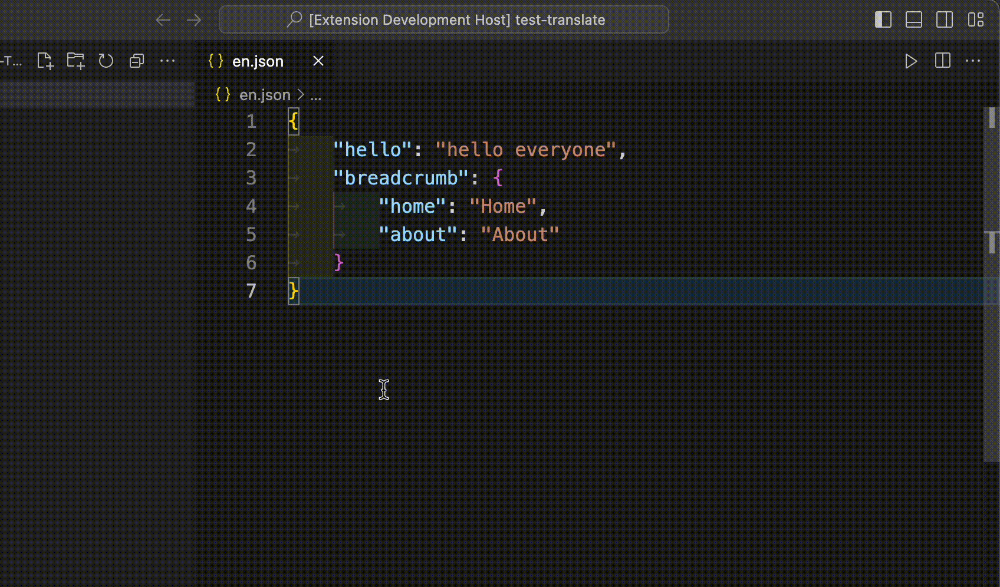
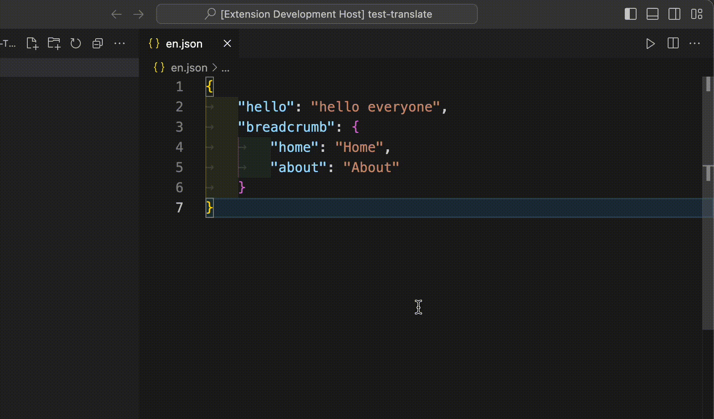
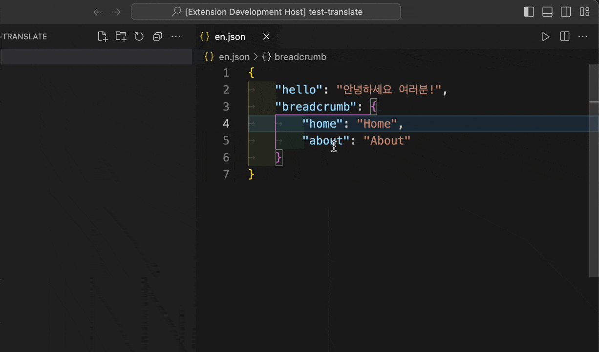
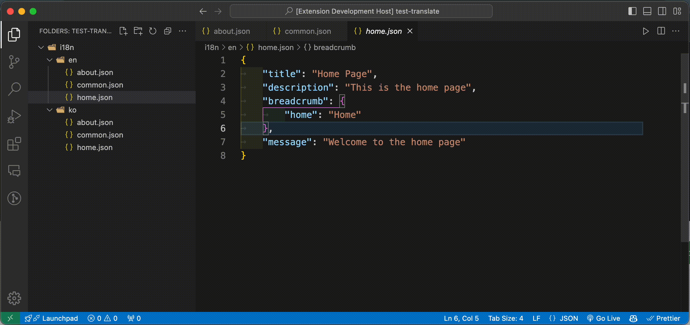

# Translate i18n

## Features

• Translate selected text or entire JSON files.

• Support for choosing source and target languages.

• Automatic language detection (if the source language is not selected).

• One-click translation to English.

• Fast and easy translation inside the editor.

## Usage

1. Translate Text (Select Source and Target Languages)

   • Select the text you want to translate in the editor, or choose the entire file.

   • Right-click on the selected text and choose Translate i18n from the context menu.

   • Select the source language and the target language.

   • The translated text will be shown in a new document.

   

2. Translate Automatically (Detect Source Language)

   • Select the text you want to translate in the editor, or choose the entire file.

   • Right-click on the selected text and choose Translate i18n Detect from the context menu.

   • The extension will automatically detect the source language and prompt you to select the target language.

   • The translated text will appear in a new document.

   

3. Translate to English

   • Select the text you want to translate in the editor, or choose the entire file.

   • Right-click and choose Translate to English.

   • The selected text will be translated into English and displayed in a new document.

   

4. Translate on Select and Hover

   • Right-click and choose `Auto translate on select and hover` and Select the language which you want to translate.

   • Now, when you select any text, it will be translated automatically on Hover.

   • The translated text will be displayed in a tooltip.

   

5. Translate Files

   • Select files you want to translate in the explorer.

   • Right-click and choose Translate i18n Files.

   • Select the target language and the destination folder where the translated files will be saved.

   • The translated files will be saved in the destination folder.

   

## License

MIT License. See LICENSE for more information.

## Author

Nguyen Vinh Tieng
