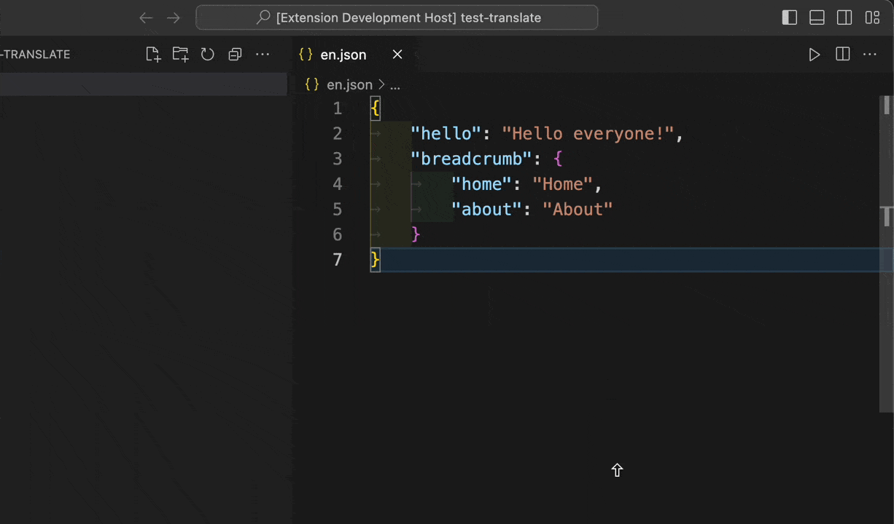
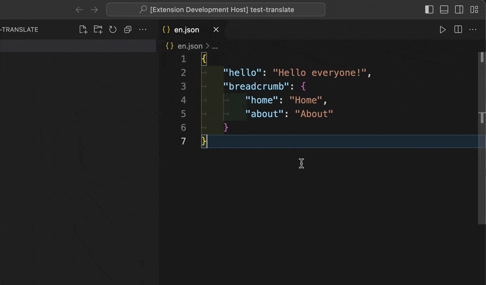

# Translate i18n

## Features

• Translate selected text or entire JSON files.
• Support for choosing source and target languages.
• Automatic language detection (if the source language is not selected).
• One-click translation to English.
• Fast and easy translation inside the editor.

## Usage

1. Translate Text (Select Source and Target Languages)
   • Select the text you want to translate in the editor, or choose the entire file.
   • Right-click on the selected text and choose Translate i18n from the context menu.
   • Select the source language and the target language.
   • The translated text will be shown in a new document.
   

2. Translate Automatically (Detect Source Language)
   • Select the text you want to translate in the editor, or choose the entire file.
   • Right-click on the selected text and choose Translate i18n Detect from the context menu.
   • The extension will automatically detect the source language and prompt you to select the target language.
   • The translated text will appear in a new document.
   

3. Translate to English
   • Select the text you want to translate in the editor, or choose the entire file.
   • Right-click and choose Translate to English.
   • The selected text will be translated into English and displayed in a new document.
   

## License

MIT License. See LICENSE for more information.
